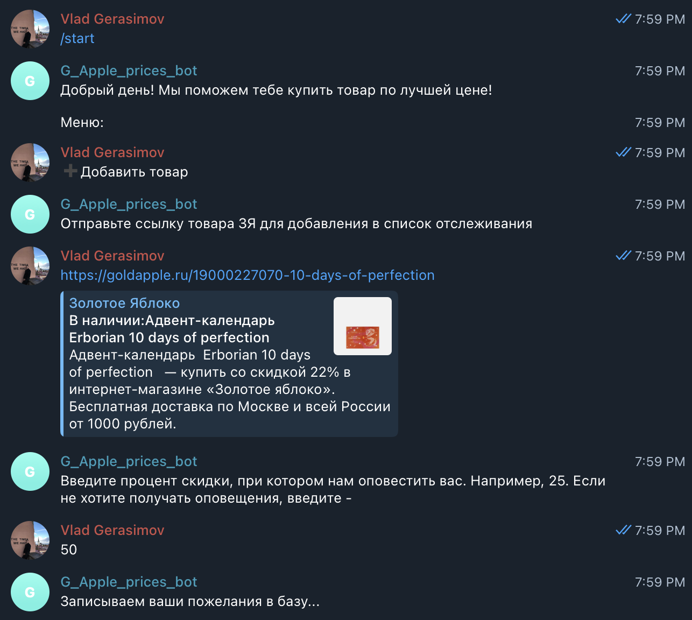
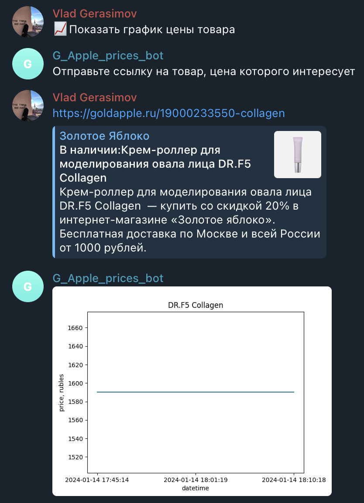

## Bigdata project

### Описание сервиса
Сервис представляет из себя систему из телеграм бота и pyspark приложения, запускающегося по расписанию на кластере.  
Через бота пользователи задают товары за ценами на которые на сайте Золотого Яблока они хотят следить, опционально можно указать интересующий размер скидки, в %, при соответствующем падении цены пользователю приходит оповещение с ссылкой на товар. Также через бота можно посмотреть на график цены товара. 
Pyspark приложение 4 раза в день выгружает цены на товары, за которыми следят пользователи, расчитывает изменения цены, при достаточном снижении цены бот уведомляет пользователей. Записывает актуальные цены в HDFS.

### Стек
* HDFS
* Pyspark
* Cron
* Telebot

### Примеры
Добавление товара:

Отображение графика цен:

Оповещение о снижении цены:
